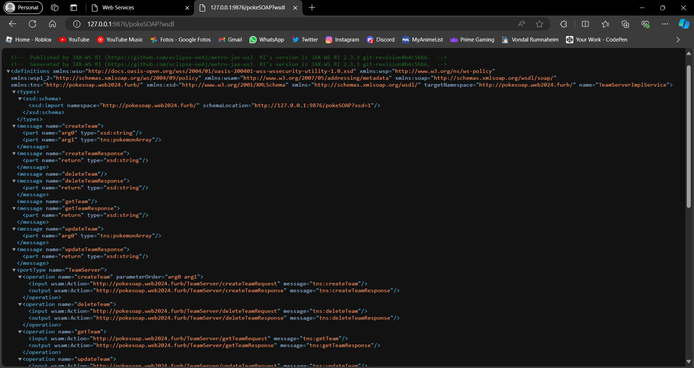

# Web Service SOAP

## O que fazer:

Com base no material estudado sobre Web Service SOAP, desenvolva um Web Service
SOAP seguindo os seguintes critérios:

**a)** Escolha uma linguagem de programação do interesse de sua equipe

**b)** Faça um projeto web para o Web Service SOAP

**c)** Defina uma temática de modo que contenha 2 classes modelo que se relacionam.
Exemplo: alunos e turmas - um aluno pode estar em várias turmas e uma turma possui
vários alunos

**d)** Crie uma classe modelo para cada uma das classes definidas. Nessa classe modelo, faça a
validação de todos os campos nos métodos sets, lançando exceções adequadas ao erro
(campo em branco, informação inválida, etc)

**e)** Crie uma classe controle para cada uma das classes modelo. Nessa classe controle deve
haver os métodos para executar um CRUD utilizando essa classe modelo. Para o trabalho,
utilize Lists ou Maps para simular a manipulação de dados em um Banco de Dados.

**f)** Transforme cada método CRUD das classes de controle em um serviço SOAP do seu Web
Service

**g)** Publique localmente seu Web Service SOAP e tire um print do WSDL gerado

**h)** Crie uma aplicação cliente simples que faça o teste do seu Web Service SOAP. Tire os
prints apresentando que seu Web Service está funcionando.

## ENTREGÁVEIS:
**a)** Código-fonte do projeto Web Service

**b)** Código-fonte da aplicação cliente

**c)** Prints apresentando que o Web Service SOAP funciona

**d)** Print do WSDL gerado

## Prints:

***Web Service SOAP***

 

***WSDL gerado***
